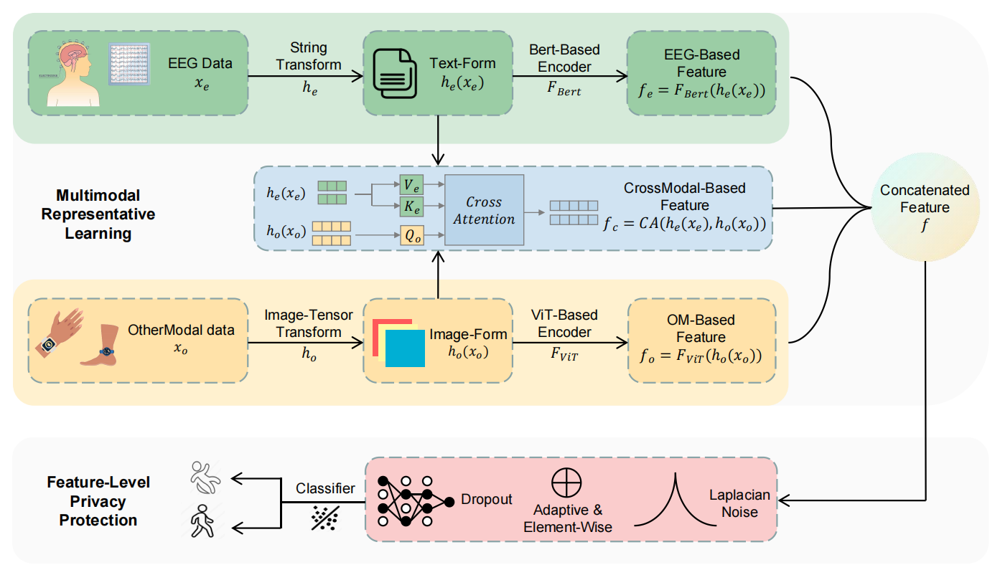

# DP-MLD

This repository is the official implementation of paper "**Differentially Private Multimodal Laplacian
Dropout (DP-MLD) for EEG Representative Learning**".



# Requirements

To install requirements:
```
pip install -r requirements.txt
```

# Dataset
## Raw dataset
We conduct experiments on an open-source multimodal dataset of FoG in PD ([Raw dataset](https://github.com/AccSrd/multimodal-Parkinson-data-processing)). This dataset encompasses data from multiple sources: electroencephalogram (EEG), skin conductance (SC), and acceleration (ACC), collected during walking tasks using various sensors. Twelve PD patients participated in the experiments, generating a total of 3 hours and 42 minutes of valid data. They first sort out the original data header, and unify the data sampling frequency to 500Hz. Then they segment and label the data. 

After combining the dataset of three tasks, there are 3003 date, each containing EEG data with 30 channels, OM data with 25 dimensions (including 24 dimensions of ACC data and 1 dimension of SC), and corresponding labels indicating the presence or absence of FoG.

## Preprocess
To run data preprocess and get embeddings:
```
python src/data/process.py
```
```
python src/data/get_embedding.py
```

# Demo
To run a demo of our method:
```
python src/demo.py
```

# Experiments
To get the results of experiments in the paper, run the .py files in the folder "src/experiments/". For example, to run the comparison of modal type:
```
python src/experiments/compare_modal.py
```
